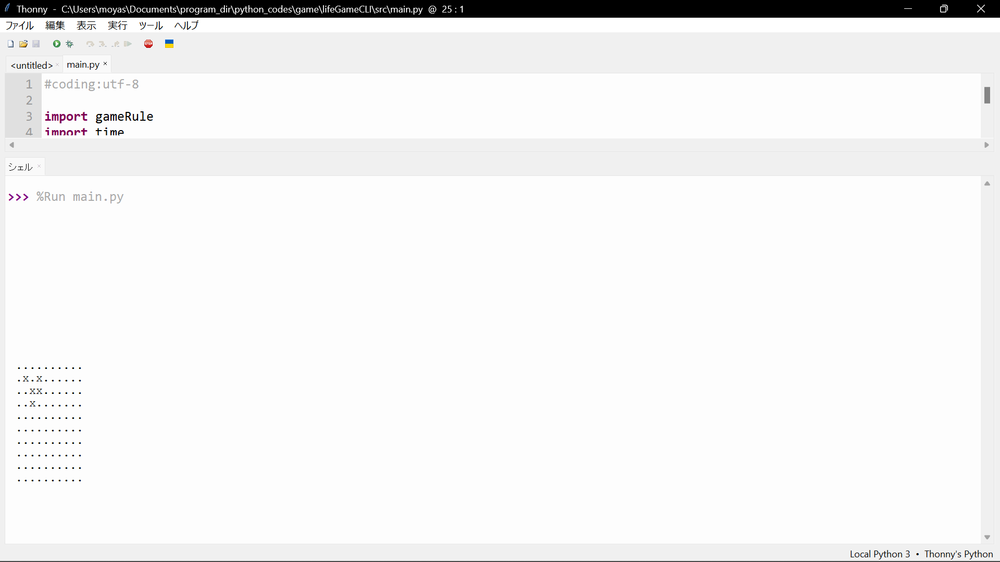
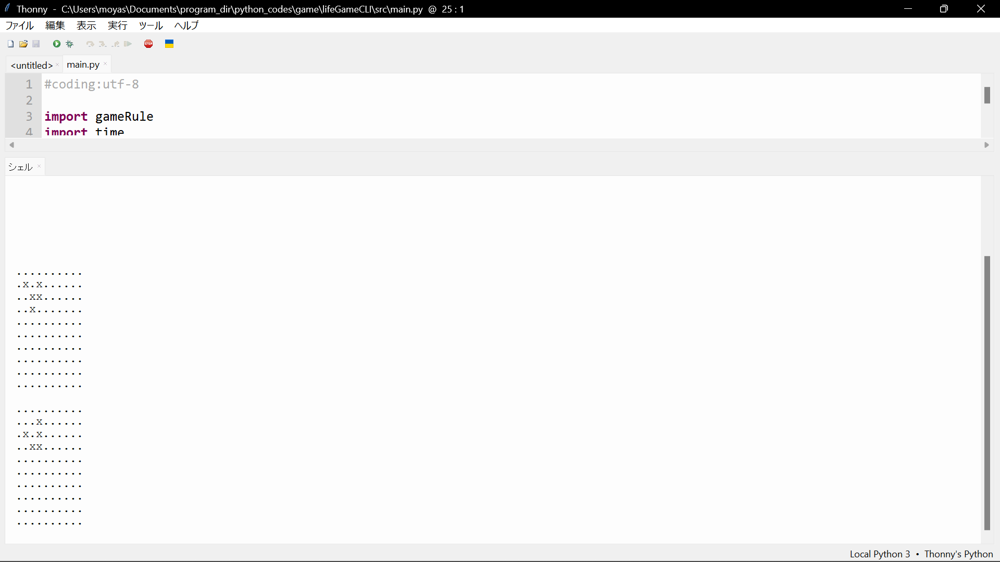
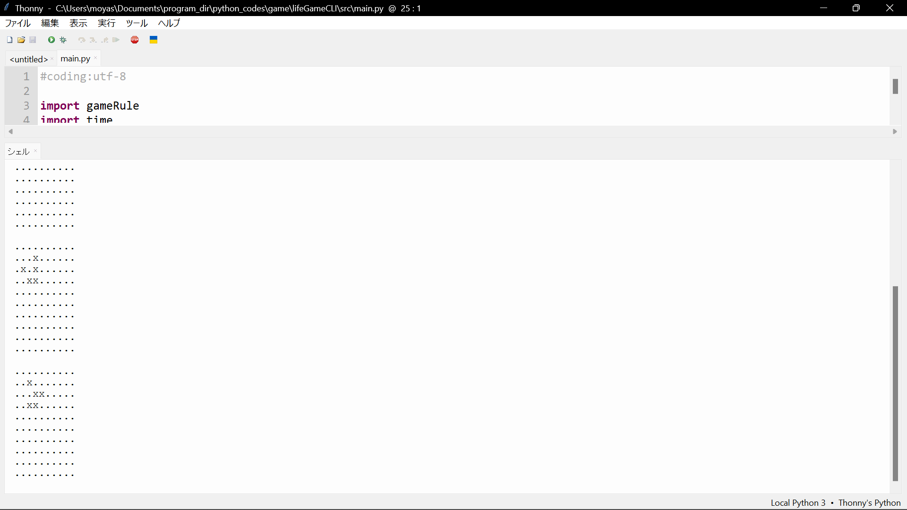

lifegame
===
仕様の説明
---

- 目標となる動作
    - lifegameというシュミレーションゲームをCLIで再現できるようにする。
    - 再現していることを示すため、lifegameの中で最も基本的で構造がシンプルな生命体であるGliderを動作させる.
    - 実行はmain.py

- 入出力に関して  
    - 入力
        - 何世代まで見たいかを聞く
            入力された回数分画面とworldの状態が更新される
    - 出力
        - 実行時の画像の通りライフゲームにおけるセルの状態を生きているセルは'x'で表し、死んでいるセルは'.'で表して出力している

- 作成したプログラムの説明

    - 各ファイルの中の変数やクラスなど
        - main.py
            - 変数
                - world_size:list  
                変数名そのままになるが、世界の大きさの情報が格納される。長さは2でworld_size\[0\]にworldの幅
                world_size\[1\]にworldの高さが格納される
                提出時点では高さ10幅10の世界を表している
                    - 命名理由:世界の大きさが格納されるから
                - generation:int  
                何世代先まで見るかを格納する
                - delay:int
                シェル領域をアップデートしてからどのくらいの間表示したままにするかを単位を秒で指定
                - gR:  
                これはGameOfLifeクラスのインスタンス
                    - 命名理由:gameRule.pyからGameOfLifeクラスを呼び出しているから gameRuleの省略 - gameRule.py
            - 関数
                - main
                    - すること
                        - どの世代まで観測したいかをプログラムの起動者に入力を促す、その時入力によって、出力する値を変化させる。この過程で、不正な入力を除去する(try except)
                        - world_size,delay,gRなどの変数にそれぞれ、初期値を代入していく。
                        - 画面をワールドの縦の大きさ分改行する。この意味は、thonny実行時には意味がないが、powershellやbashなどでは、outputUtilのANSIエスケープコード実行時に実行時のプロンプトを消さないという意味がある。
                        - generation回だけoutputUtil.pyのprintWrold関数,gameRule.pyのGameOfLifeクラスのupdateメソッド,time.sleep()を各々呼び出して、順次画面とgRインスタンスのworld変数の中身を書き換えていく

        - gameRule.py
            - クラス
                - GameOfLife:  
                具体的にはlifegameの世代交代に関するメソッドが定義してある。コンストラクタやメソッドの説明は以下にする.
                - 命名理由:lifegameはgame of lifeと呼ばれることがあるから。そもそも発案者のコンウェイさんはconway's game of lifeと読んでいたらしい.
                    - 主なクラス変数
                        - world_size:tuple or listどっちでもいい  
                            - 命名理由:世界の大きさの情報を格納する
                        世界の大きさ クラスローカル
                        - world:list  
                            - 命名理由:世界の状態、具体的には各セルが生きているか死んでいるかの情報を格納するから
                        世界の状態を記憶する
                        - tmp_world:list  
                            - 命名理由:worldの命名理由と同じ
                        世界の状態の一時的な保管場所.主にはcountCellsメソッド実行時に使用される
                        - count:int  
                            - 命名理由:指定されたセルの周囲の生きている数をカウントした情報を格納するから
                        特定のセルの周囲に何個の生きたセルがあるかを格納する  
                        judgeメソッドやcountCellsメソッドで出てくる。名前空間はメソッドローカルでしかないが重要なのであげた。

                    - 主なメソッド
                        - __init__()  
                            - 命名理由:コンストラクタだから、理由なし
                            - 引数 world_size:
                            これは世界の大きさを表す1次元配列で
                            len(world_size)==2はTrueを返します.
                            - すること
                                - 世界の大きさデータをGameOfLifeインスタンス生成時に受け取り。それをクラス変数world_sizeに代入
                                - allDeathメソッドの呼び出し
                                - tmp_worldクラス変数を作成
                        - allDeath()
                            - 命名理由:worldの中のすべてのセルをFalseつまり死にリセットするから.
                            -  すること
                                - クラス変数worldの中身をすべてFalseで初期化
                        - update()
                            - 命名理由:世代交代の命令を定義しているから
                            - すること
                                - 実行時点でのworldの各セルに対してjudgeメソッドを使って次の世代そのセルが生きるか死ぬかを判断し、そのデータをtmp_worldクラス変数に一時的に記憶,これをしないと、judgeメソッドを実行する度にworldクラス変数の中身が変わるので正しく世代交代できない
                                - そのあと一気にtmp_worldのデータをworldにコピー
                        - createGlider()
                            - 命名理由:指定された場所にgliderを創造するから
                            - すること
                                - gliderを指定された場所に作成するためにworldの情報を書き換える
                        - judge()
                            - 命名理由:指定されたセルが生きているか死んでいるか判断するために作ったから
                            - すること
                                - 引数で指定されたセルに対してcountCellsメソッドを実行して。以下の状況に応じてbool型の値を戻り値として返す
                                    - 指定されているセルがこのメソッドの実行時に生きている場合  
                                        - countが2か3の時はTrueを返す
                                        - それ以外の場合はFalseを返す
                                    - 指定されているセルがこのメソッドの実行時に死んでいる場合
                                        - countが3の場合はTrueを返す
                                        - それ以外の場合はFalseを返す。
                                - これで実現したいのは以下のこと
                                    > - 誕生  
                                    >   死んでいるセルに隣接する生きたセルがちょうど3つあれば、次の世代が誕生する。  
                                    > - 生存  
                                    >   生きているセルに隣接する生きたセルが2つか3つならば、次の世代でも生存する。  
                                    > - 過疎  
                                    >   生きているセルに隣接する生きたセルが1つ以下ならば、過疎により死滅する。  
                                    > - 過密  
                                    >   生きているセルに隣接する生きたセルが4つ以上ならば、過密により死滅する。  
                                    > ([wiki][1]より)  
                        - countCells()  
                            - 命名理由:指定されたセルの周囲の生きているセルの数をカウントするから.
                            - すること
                                - 引数で指定されたセルの周囲の生きているセルの数がいくつあるかを返す。
                                - 指定されたセルの周りの８個のセルの状態を順に確認していき、それぞれのセルが生きていたらクラス変数countに１加算
                                - 最後に戻り値としてcountの中身を返す.
        - outputUtil.py
            - 関数
                - printWorld()
                    - 命名理由  
                    渡された２次元配列の中身をわかりやすくシェル上に出力するから.

                    - 引数:world(2次元の配列を格納している. list型)
                    - すること
                        - 呼び出されてからすぐにANSI文字コードでカーソルを元の位置に戻す。(これはthonnyでは機能しないがコードの説明に必要だと判断した)
                        - 渡された配列の中身の要素をfor構文で一つ一つ確認していき,中身がTrueなら文字列"x"を改行なしで出力しFalseなら文字列"."を改行なしで出力する。

- 実行時の様子の説明
    - 実行時の画像
        - image1
        
        - image2
        
        - image3
        
    - 説明  
    上の３つの画像は上から順番に実行してからどのように出力が変化するかを示している。
    image1は実行直後で、この時プログラム側ではgameRule.pyの中のGameOfLifeクラスの中のcreateGriderメソッドによって一つグライダーが作られている状態。image2,image3はimage1が出力されてからそれぞれdelay秒後,2*delay秒後に出力される内容。ここでdelayはmain.pyの中のdelay変数を示している。

- 参考文献
    - Web
        - ページタイトル:How To Become A Hacker: Japanese
            - URL:https://cruel.org/freeware/hacker.html
            - 著者:Eric S. Raymond
            - 翻訳:山形浩生,村川泰,Takachin
            - 最終参照日:2022/12/18
        - ページタイトル:ライフゲーム - Wikipedia
            - URL:https://ja.wikipedia.org/wiki/%E3%83%A9%E3%82%A4%E3%83%95%E3%82%B2%E3%83%BC%E3%83%A0
            - 著作者:不明
            - 最終参照日:2022/12/18
        - ページタイトル:game_of_life/src at main · yoshiyuki-140/game_of_life
            - URL:https://github.com/yoshiyuki-140/game_of_life/tree/main/src
            - 著者:Yoshiyuki Kurose(過去)
            - 最終参照日:2022/12/18
        - ページタイトル:ANSIエスケープコード - コンソール制御 - 碧色工房
            - URL:https://www.mm2d.net/main/prog/c/console-02.html#:~:text=%E3%82%A8%E3%82%B9%E3%82%B1%E3%83%BC%E3%83%97%E3%82%B3%E3%83%BC%E3%83%89%E3%81%AE%E6%96%87%E5%AD%97%E3%82%B3%E3%83%BC%E3%83%89,%E9%80%B2%E6%95%B0%E3%81%A7%20%5Cx1b%20%E3%81%A8%E3%81%AA%E3%82%8B%E3%80%82
            - 著作者:大前 良介 (OHMAE Ryosuke)
            - 最終参照日:2022/12/18
    - 書籍
        - 書名:Python ゼロから始めるプログラミング
            - 著者:三谷 純
            - 出版社:翔泳社
            - 出版年:2021/5/24
        - 書名:Python基礎&実践プログラミング
            - 著者:Magnus Lie Hetland
            - 訳者:武舎 広幸,阿部 和也,上西 昌弘
            - 技術監修者:松浦 健一郎,司 ゆき
            - 発行人:小川 亨
            - 編集者:高橋 隆志
            - 出版社:インプレス
            - 出版年:2020/2/21
        - 署名:これ以上やさしく説明できない!Python初めの一歩
            - 著者:西晃生
            - 出版社:株式会社ナツメ社
            - 出版年:2019/1/1
        - 署名:みんなのPython 第４版
            - 著者:柴田淳
            - 出版社:SBクリエイティブ株式会社
            - 出版年:2017/1/5
        

[1]:https://ja.wikipedia.org/wiki/%E3%83%A9%E3%82%A4%E3%83%95%E3%82%B2%E3%83%BC%E3%83%A0
